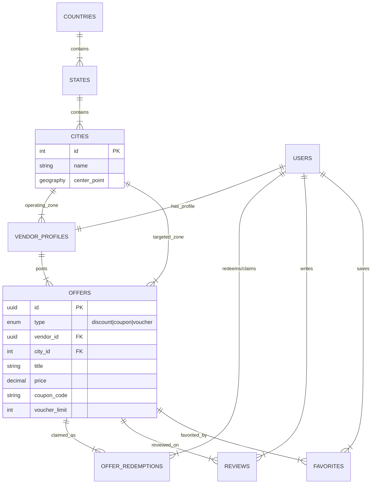

Database Schema & Design

This schema implements the **Global CSC (Country-State-City)** architecture and the **Unified Offer Table** strategy we decided upon. It relies on **PostgreSQL** with **PostGIS** for location intelligence.

-----

### **1. Entity & Relationship Overview**

1.  **Location (The Backbone):**
      * **`countries`** → **`states`** → **`cities`** (Zones).
      * *Key Concept:* The `cities` table represents the hyper-local **"Zone"** (e.g., Gulshan) and contains a geospatial center point for the Auto-Detect feature.
2.  **Users & Vendors:**
      * **`users`**: Base authentication entity (Customers, Vendors, Admins).
      * **`vendor_profiles`**: Extension of the user table. It is linked to a specific `city_id` (Operating Zone) and has a precise `shop_location` (Map Pin).
3.  **Offers (Unified):**
      * **`offers`**: Central table for **Discounts**, **Coupons**, and **Vouchers**.
      * Linked to `vendor_profiles` (Owner) and `cities` (Target Zone).
4.  **Engagement:**
      * **`offer_redemptions`**: Tracks who claimed a voucher or copied a coupon code.
      * **`favorites`**: Users saving deals.
      * **`reviews`**: Ratings for vendors.

-----

### **2. Mermaid ER Diagram**



-----

### **3. PostgreSQL DDL Statements**

Run these commands in order to set up the schema.

#### **A. Extensions & Enums**

```sql
-- Enable Geospatial features for Maps and Distance calculations
CREATE EXTENSION IF NOT EXISTS postgis;
-- Enable UUID generation for secure IDs
CREATE EXTENSION IF NOT EXISTS "uuid-ossp";

-- ENUMS: Strict typing for logic
CREATE TYPE user_role AS ENUM ('customer', 'vendor', 'admin');
CREATE TYPE offer_status AS ENUM ('draft', 'active', 'expired', 'banned');
-- The 3 distinct types we agreed on
CREATE TYPE offer_type AS ENUM ('discount', 'coupon', 'voucher'); 
```

#### **B. Location Module (CSC Hierarchy)**

```sql
CREATE TABLE countries (
    id SERIAL PRIMARY KEY,
    name VARCHAR(100) NOT NULL,
    iso_code CHAR(2) NOT NULL UNIQUE, -- e.g., 'BD'
    currency_symbol VARCHAR(10) DEFAULT '৳',
    phone_code VARCHAR(10),
    created_at TIMESTAMP WITH TIME ZONE DEFAULT NOW()
);

CREATE TABLE states (
    id SERIAL PRIMARY KEY,
    name VARCHAR(100) NOT NULL, -- e.g., 'Dhaka Division'
    country_id INT NOT NULL REFERENCES countries(id) ON DELETE CASCADE
);

-- The "Zone" Table
CREATE TABLE cities (
    id SERIAL PRIMARY KEY,
    name VARCHAR(100) NOT NULL, -- e.g., 'Gulshan'
    state_id INT NOT NULL REFERENCES states(id) ON DELETE CASCADE,
    
    -- The "Center Point" used for Auto-Detect logic
    center_point GEOGRAPHY(POINT, 4326), 
    
    is_active BOOLEAN DEFAULT TRUE,
    
    -- Simple Index for standard lookups
    CONSTRAINT uq_city_state UNIQUE(name, state_id)
);

-- Spatial Index for fast "Nearest Zone" calculation
CREATE INDEX idx_cities_center ON cities USING GIST (center_point);
```

#### **C. User & Vendor Module**

```sql
CREATE TABLE users (
    id UUID PRIMARY KEY DEFAULT uuid_generate_v4(),
    email VARCHAR(255) UNIQUE NOT NULL,
    password_hash VARCHAR(255) NOT NULL,
    role user_role DEFAULT 'customer',
    full_name VARCHAR(100),
    avatar_url TEXT,
    is_verified BOOLEAN DEFAULT FALSE,
    created_at TIMESTAMP WITH TIME ZONE DEFAULT NOW()
);

CREATE TABLE vendor_profiles (
    user_id UUID PRIMARY KEY REFERENCES users(id) ON DELETE CASCADE,
    business_name VARCHAR(150) NOT NULL,
    contact_phone VARCHAR(20),
    logo_url TEXT,
    cover_image_url TEXT,
    description TEXT,
    
    -- The Zone this vendor belongs to (for Feed logic)
    operating_city_id INT NOT NULL REFERENCES cities(id),
    
    -- Exact Pin location on map
    shop_location GEOGRAPHY(POINT, 4326), 
    address_text TEXT,
    
    -- Flexible metadata (Opening hours, Social links)
    meta_data JSONB DEFAULT '{}', 
    
    -- Cached Aggregates
    rating_avg DECIMAL(3, 2) DEFAULT 0.00,
    review_count INT DEFAULT 0,
    follower_count INT DEFAULT 0
);

-- Spatial Index for "Shop Near Me" map view
CREATE INDEX idx_vendor_location ON vendor_profiles USING GIST (shop_location);
```

#### **D. Offers Module (Unified Table)**

```sql
CREATE TABLE offers (
    id UUID PRIMARY KEY DEFAULT uuid_generate_v4(),
    vendor_id UUID NOT NULL REFERENCES vendor_profiles(user_id) ON DELETE CASCADE,
    
    -- Denormalized City ID: Crucial for fast Feed queries without joining Vendor table
    city_id INT NOT NULL REFERENCES cities(id),
    
    -- CONTENT
    title VARCHAR(255) NOT NULL,
    description TEXT,
    images JSONB DEFAULT '[]', -- Array of image URLs
    terms_and_conditions TEXT,
    
    -- CLASSIFICATION
    type offer_type NOT NULL, -- discount | coupon | voucher
    status offer_status DEFAULT 'active',
    
    -- 1. FIELDS FOR 'DISCOUNT'
    original_price DECIMAL(10, 2),
    discounted_price DECIMAL(10, 2),
    discount_percent INT, -- Calculated field (e.g. 20%)
    
    -- 2. FIELDS FOR 'COUPON' (Code based)
    coupon_code VARCHAR(50), -- e.g. "SUMMER20"
    
    -- 3. FIELDS FOR 'VOUCHER' (Claim based)
    voucher_limit INT, -- Max number of claims (e.g., 50)
    voucher_claimed_count INT DEFAULT 0, -- Concurrency counter
    
    -- SCHEDULING
    valid_from TIMESTAMP WITH TIME ZONE DEFAULT NOW(),
    valid_until TIMESTAMP WITH TIME ZONE NOT NULL,
    
    -- METRICS
    views_count INT DEFAULT 0,
    clicks_count INT DEFAULT 0,

    created_at TIMESTAMP WITH TIME ZONE DEFAULT NOW()
);

-- COMPOSITE INDEX: The most important index for the Feed
-- "Show me Active offers in Gulshan (ID 5) sorted by Newest"
CREATE INDEX idx_feed_query ON offers (city_id, status, valid_until, created_at DESC);
```

#### **E. Engagement & Redemptions**

```sql
-- Tracks who Copied a Code or Claimed a Voucher
CREATE TABLE offer_redemptions (
    id UUID PRIMARY KEY DEFAULT uuid_generate_v4(),
    offer_id UUID NOT NULL REFERENCES offers(id) ON DELETE CASCADE,
    user_id UUID NOT NULL REFERENCES users(id) ON DELETE CASCADE,
    
    -- Status of the redemption
    is_used_in_store BOOLEAN DEFAULT FALSE, -- Used for QR Scan verification
    redeemed_at TIMESTAMP WITH TIME ZONE, -- When scanned
    
    created_at TIMESTAMP WITH TIME ZONE DEFAULT NOW(), -- When claimed/saved

    -- Constraint: User can claim a specific offer only once
    UNIQUE(offer_id, user_id)
);

CREATE TABLE favorites (
    user_id UUID REFERENCES users(id) ON DELETE CASCADE,
    offer_id UUID REFERENCES offers(id) ON DELETE CASCADE,
    created_at TIMESTAMP DEFAULT NOW(),
    PRIMARY KEY (user_id, offer_id)
);

CREATE TABLE reviews (
    id UUID PRIMARY KEY DEFAULT uuid_generate_v4(),
    user_id UUID REFERENCES users(id),
    vendor_id UUID REFERENCES vendor_profiles(user_id),
    rating INT CHECK (rating >= 1 AND rating <= 5),
    comment TEXT,
    created_at TIMESTAMP DEFAULT NOW()
);
```

-----

### **4. Scaling & Optimization Strategy**

#### **A. Partitioning (Future Proofing)**

The `offers` table will grow very fast.

  * **Strategy:** **Declarative Partitioning by Time**.
  * **Why:** Users rarely look at expired offers from 2 months ago.
  * **Action:** Partition the `offers` table by the `valid_until` column.
      * `offers_current`: Stores valid offers.
      * `offers_archive_2024`: Stores expired offers.
      * *Benefit:* Feed queries only scan the small `offers_current` partition, remaining lightning fast.

#### **B. Caching (Redis)**

PostgreSQL is fast, but `SELECT * FROM offers` for every scroll is bad.

  * **Zone Feed Cache:**
      * Key: `feed:zone:{cityId}:page:1`
      * Value: JSON Array of top 20 offers.
      * **TTL:** 5 - 10 minutes.
  * **Invalidation Strategy:** When a vendor in "Gulshan" posts a new offer, delete keys matching `feed:zone:5:*`.

#### **C. Search (Typesense)**

  * Don't use PostgreSQL for full-text search (`LIKE %query%`).
  * Sync the `offers` table to **Typesense** whenever an offer is created or updated.
  * Search queries go to Typesense → Return IDs → Fetch details from DB.

#### **D. Concurrency for Vouchers**

  * For **"First 50 people only"** vouchers, strict concurrency is needed.
  * **SQL Strategy:**
    ```sql
    UPDATE offers 
    SET voucher_claimed_count = voucher_claimed_count + 1 
    WHERE id = $offerId AND voucher_claimed_count < voucher_limit;
    ```
    If this update returns `0 rows affected`, it means the limit is reached.

-----
