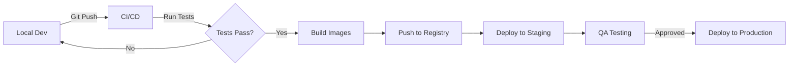

# Deployment Architecture

## Overview

Offerify uses a **hybrid deployment strategy** optimized for both development velocity and production performance.

---

## Local Development Architecture

### Philosophy
**Containers for State, Native for Code**

- ✅ **Docker**: Stateful infrastructure (databases, caches)
- ✅ **Native**: Application code (backend, frontend)

### Why This Approach?

| Aspect | Docker | Native | Winner |
|--------|--------|--------|--------|
| **Hot Reload** | Slow (volume sync) | Instant | 🥇 Native |
| **Debugging** | Complex (port forwarding) | Direct | 🥇 Native |
| **Performance** | Virtualization overhead | Full CPU/RAM | 🥇 Native |
| **Consistency** | Same as production | OS-dependent | 🥇 Docker |
| **Database State** | Persistent, isolated | Requires local install | 🥇 Docker |

**Verdict:** Use Docker for what it's best at (isolation, persistence), Native for speed.

---

### Development Stack

```
┌─────────────────────────────────────────┐
│          Developer Machine              │
├─────────────────────────────────────────┤
│                                         │
│  ┌─────────────┐    ┌──────────────┐   │
│  │   Backend   │    │   Frontend   │   │
│  │  (Node.js)  │    │  (Expo Web)  │   │
│  │  Port 3000  │    │  Port 8081   │   │
│  └──────┬──────┘    └──────────────┘   │
│         │                               │
│         ▼                               │
│  ┌─────────────────────────────────┐   │
│  │     Docker Compose Services     │   │
│  ├─────────────────────────────────┤   │
│  │ PostgreSQL (PostGIS) - 5432     │   │
│  │ Redis - 6379                    │   │
│  │ Typesense - 8108                │   │
│  └─────────────────────────────────┘   │
└─────────────────────────────────────────┘
```

### Connection Flow
1. Developer runs `make dev`
2. Docker starts PostgreSQL, Redis, Typesense
3. Backend connects to `localhost:5432` (DB)
4. Frontend connects to `localhost:3000` (Backend API)
5. Developer edits code → Instant hot reload

---

## Production Architecture

### Philosophy
**Fully Containerized, Nginx-Optimized**

Everything runs in Docker for:
- ✅ Portability (deploy anywhere)
- ✅ Scalability (replicate containers)
- ✅ Security (isolated networks)
- ✅ Performance (optimized builds)

---

### Production Stack

```
┌────────────────────────────────────────────────┐
│              Production Server                 │
├────────────────────────────────────────────────┤
│                                                │
│  ┌──────────────────────────────────────────┐ │
│  │         Nginx Reverse Proxy               │ │
│  │         (Port 80/443)                     │ │
│  └─────────┬────────────────────────────────┬┘ │
│            │                                │  │
│            │                                │  │
│  ┌─────────▼──────────┐        ┌───────────▼──┐ │
│  │   Frontend (Nginx) │        │  Backend API │ │
│  │   Static Files     │        │   (Node.js)  │ │
│  │   Port 80          │        │  Port 3000   │ │
│  └────────────────────┘        └──────┬───────┘ │
│                                       │         │
│                       ┌───────────────┴─────┐  │
│                       │  offerify-network   │  │
│                       │   (Docker Bridge)   │  │
│                       └───────────┬─────────┘  │
│                                   │             │
│  ┌────────────────┬───────────────┴────────┐  │
│  │                │                        │  │
│  │  PostgreSQL    │     Redis    │ Typesense│  │
│  │  (PostGIS)     │              │          │  │
│  └────────────────┴──────────────┴──────────┘  │
│                                                │
└────────────────────────────────────────────────┘
```

### Production Optimizations

#### Backend
- **Multi-stage build**: Separate build and runtime stages
- **Production dependencies only**: Smaller image size
- **Non-root user**: Security best practice
- **Health checks**: Auto-restart on failure

#### Frontend
- **Static build**: `expo export -p web` → HTML/JS/CSS
- **Nginx serving**: Faster than Node.js serve
- **Gzip compression**: Reduced bandwidth
- **Asset caching**: 1-year cache for static files
- **Security headers**: XSS, CSP, Frame protection

#### Databases
- **Named volumes**: Data persistence across restarts
- **Health checks**: Ensure availability before app starts
- **Internal network**: Not exposed to public internet

---

## Comparison: Dev vs Prod

| Component | Development | Production |
|-----------|-------------|------------|
| **Backend** | Native Node.js (`npm run start:dev`) | Docker → Optimized build → `node dist/main` |
| **Frontend** | Native Expo (`npx expo start --web`) | Docker → Static build → Nginx |
| **PostgreSQL** | Docker (dev config) | Docker (production config) |
| **Redis** | Docker (no password) | Docker (password required) |
| **Typesense** | Docker (dev API key) | Docker (strong API key) |
| **Network** | `localhost` | Internal `offerify` bridge |
| **Persistence** | Volumes (can reset) | Volumes (must backup) |
| **Hot Reload** | ✅ Yes (instant) | ❌ No (requires rebuild) |
| **SSL/HTTPS** | ❌ No | ✅ Yes (with reverse proxy) |

---

## Deployment Strategies

### 1. Single Server Deployment
**Use `docker-compose.prod.yml` directly**

```bash
# On production server
make docker-prod
```

**Best for:**
- MVPs
- Small to medium traffic
- Budget-conscious projects

---

### 2. Container Orchestration (Kubernetes/Swarm)
**Convert to K8s manifests**

```bash
# Generate Kubernetes YAML
kompose convert -f docker-compose.prod.yml
```

**Best for:**
- High availability requirements
- Auto-scaling needs
- Multi-region deployment

---

### 3. Platform-as-a-Service (Railway, Render, Fly.io)
**Use existing Dockerfiles**

Each service (backend, frontend, db) deployed separately.

**Best for:**
- Zero DevOps overhead
- Quick deployment
- Managed databases

---

## Environment Variables

### Development (.env files)
```
backend/.env  → Backend configuration
frontend/.env → Frontend API URL
```

### Production (docker-compose.prod.yml)
```
.env (root) → All production secrets
```

**Critical Variables:**
- `DB_PASSWORD`: Strong password (not "yourpassword")
- `JWT_SECRET`: Random 64-char string
- `TYPESENSE_API_KEY`: Random 32-char string
- `FRONTEND_API_URL`: Public backend URL

---

## Scaling Considerations

### Horizontal Scaling (Multiple Instances)
```yaml
# docker-compose.prod.yml
backend:
  deploy:
    replicas: 3  # Run 3 backend instances
```

**Requirements:**
- Load balancer (Nginx, HAProxy)
- Session storage in Redis (not in-memory)
- Stateless backend design

---

### Vertical Scaling (More Resources)
```yaml
# docker-compose.prod.yml
backend:
  deploy:
    resources:
      limits:
        cpus: '2'
        memory: 4G
```

---

## Security Checklist

### Production Must-Haves
- [ ] Strong passwords for all databases
- [ ] JWT secret is random and secure
- [ ] Nginx SSL/TLS enabled (HTTPS)
- [ ] Security headers configured
- [ ] Non-root users in containers
- [ ] Internal network for DB communication
- [ ] Regular backups of PostgreSQL volumes
- [ ] Rate limiting on API endpoints
- [ ] CORS configured correctly

---

## Monitoring & Logs

### View Logs
```bash
# Development
make logs

# Production
make logs-prod

# Specific service
docker logs -f <container_name>
```

### Health Checks
All services have health checks:
- PostgreSQL: `pg_isready`
- Redis: `redis-cli ping`
- Typesense: `curl /health`
- Backend: Custom HTTP health endpoint

---

## Backup & Recovery

### Database Backup
```bash
# Backup PostgreSQL
docker exec <postgres_container> pg_dump -U postgres offerify_db > backup.sql

# Restore
docker exec -i <postgres_container> psql -U postgres offerify_db < backup.sql
```

### Volume Backup
```bash
# Backup volume data
docker run --rm -v postgres_data:/data -v $(pwd):/backup alpine tar czf /backup/postgres_backup.tar.gz -C /data .

# Restore
docker run --rm -v postgres_data:/data -v $(pwd):/backup alpine tar xzf /backup/postgres_backup.tar.gz -C /data
```

---

## Migration Path: Dev → Staging → Production



**Recommended Flow:**
1. Develop locally (`make dev`)
2. Test locally (`make test`)
3. Push to Git
4. CI/CD builds Docker images
5. Deploy to staging environment
6. Manual QA approval
7. Deploy to production

---

## Summary

| | Development | Production |
|-|-------------|------------|
| **Goal** | Fast iteration | Reliability & Performance |
| **Strategy** | Hybrid (Docker + Native) | Full Docker |
| **Backend** | Node.js (native) | Optimized container |
| **Frontend** | Expo dev server | Static files + Nginx |
| **Deploy Command** | `make dev` | `make docker-prod` |
